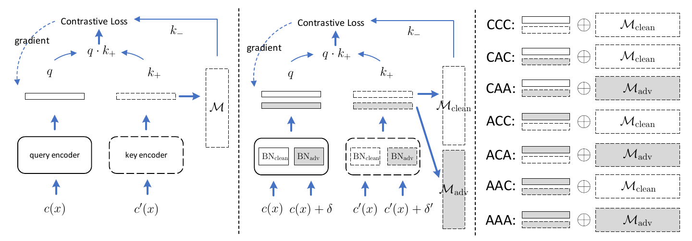
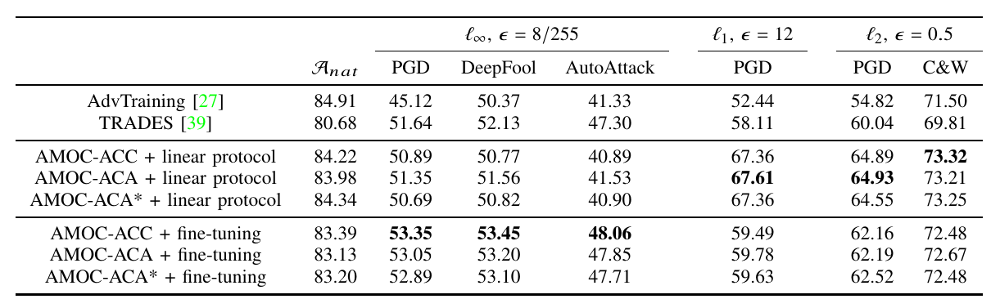

## Adversarial MOmentum-Contrastive Pre-Training

[Adversarial Momentum-Contrastive pre-training (AMOC) is a pre-training approach for robust model.](https://arxiv.org/abs/2012.13154)






The trained model  in Table could be download [here](https://drive.google.com/file/d/1e2WmUrOXHTuwTcf27I3OpHeB9oz4B4bT/view?usp=sharing).

## Requirements


```
pytorch1.4.0
foolbox3.0.4
```


## Files


```
|--data # You could overwrite the ROOT to specify the directory in config.py of src.
|--AMOC |-autoattack
		|-infos	|-LinearAT |-cifar10-resnet18 |-ACC  |-paras.pt
				|-PreTrain |-cifar10-resnet18 |-ACC  |-paras.pt
				|...
		|-models
		|-src   |-config.py
		|       |- ...
		|-auto_attack.py # using AutoAttack
		|-cifar_c_eval.py # CIFAR-10-C
		|-linear_adv.py
		|-linear_std.py
		|-linear_trades.py
		|-pre_train.py
		|-white_box_attack.py # other attacks: PGD, C&W, Deepfool ...
```


## Usage


### Pre-train


Pre-train the encoder as follows:

```
python pre_train.py resnet18 cifar10 --moco_type=ACC --leverage=0.5 -T=0.2 -K1=32768 -K2=32768 --moco_mom=0.999 -b=256
```

where moco_type is the option introduced in paper including CCC, CAC, CAA, ACC, ACA, AAC, AAA and ACA_PLUS.


**Note:**  Ours does not implement the shuffle BN used in MoCo since all experiments are conducted with a single GPU.


### Fine-tune

RobEv: Fine-tune the model using adversarial samples.

StdEv: Fine-tune the model using clean samples.

#### RobEv

Train the linear classifier:

```
python linear_at.py resnet18 cifar10 --info_path=/path/of/pre-trained/model -lp=FC --epochs=25
```

or fine-tune the entire model:

```
python linear_at.py resnet18 cifar10 --info_path=/path/of/pre-trained/model -lp=TOTAL --epochs=40
```


**Note:** If you want to fine-tune the pre-trained model of CCC, CAC or CAA, you shall add "--bn_adv" to active the clean BN .

#### StdEv


Train the linear classifier:

```
python linear_std.py resnet18 cifar10 --info_path=/path/of/pre-trained/model -lp=FC --epochs=25
```

or fine-tune the entire model:

```
python linear_std.py resnet18 cifar10 --info_path=/path/of/pre-trained/model -lp=TOTAL --epochs=40
```


## Evaluation


### AutoAttack


You could use [AutoAttack](https://github.com/fra31/auto-attack) to evaluate our models by

```
python auto_attack.py resnet18 cifar10 /path/of/model --version=standard --norm=Linf --epsilon=8/255
```

Similarly, if you attack the model of CCC, CAC, CAA, you shall use "--bn_adv"  to active the clean BN.

### Other Attacks


Evaluate the robustness by unseen attacks based on [FoolBox](https://github.com/bethgelab/foolbox).


PGD-LINF:

```
python white_box_attack.py resnet18 cifar10 /path/of/model --attack=pgd-linf --epsilon_min=8/255 --epsilon_max=1 --epsilon_times=1 --stepsize=0.1 --steps=20
```

PGD-L1

```
python white_box_attack.py resnet18 cifar10 /path/of/model --attack=pgd-l1 --epsilon_min=12 --epsilon_max=12 --epsilon_times=1 --stepsize=0.1 --steps=50
```

PGD-L2

```
python white_box_attack.py resnet18 cifar10 /path/of/model --attack=pgd-l2 --epsilon_min=0.5 --epsilon_max=0.5 --epsilon_times=1 --stepsize=0.1 --steps=50
```


DeepFool-LINF:

```
python white_box_attack.py resnet18 cifar10 /path/of/model --attack=deepfool-linf --epsilon_min=8/255 --epsilon_max=1 --epsilon_times=1 --stepsize=0.02 --steps=50
```


C&W-L2:

```
python white_box_attack.py resnet18 cifar10 /path/of/model --attack=cw-l2 --epsilon_min=0.5 --epsilon_max=0.5 --epsilon_times=1 --stepsize=0.1 --steps=100
```

